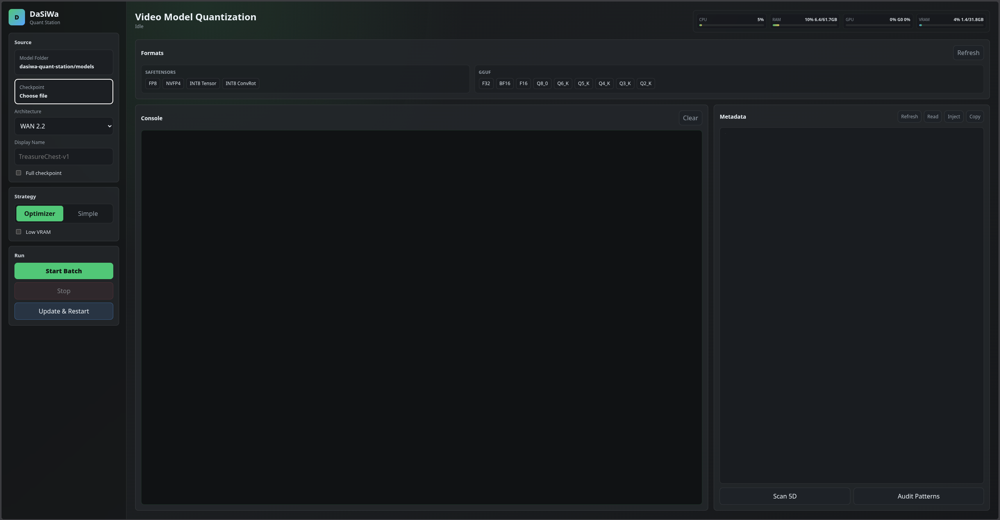

# DaSiWa Quant Station

DaSiWa Quant Station is a local quantization and LoRA merge workbench for video diffusion models. It combines a modern Go-powered web UI with proven Python quantization engines for GGUF and safetensors workflows, plus architecture-aware LoRA merging with per-LoRA strategy control.

Built around the practical pain points of WAN 2.2 and LTX-2.3 style video checkpoints: preserving 5D/video-critical tensors, keeping full-checkpoint companion modules safe, injecting modelspec metadata, avoiding INT8 paths that produce corrupted video, and merging LoRAs with architecture-specific tensor classification.



## Highlights

- **Modern local UI:** Go server with vanilla JS/CSS frontend at `http://127.0.0.1:7878`. Dark theme, responsive layout, no heavy frameworks.
- **Safetensors quantization:** FP8, NVFP4, INT8 Tensor-wise, INT8 Row-wise ConvRot (runtime) through `silveroxides/convert_to_quant`.
- **GGUF conversion:** GGUF F32/BF16/F16/Q8_0/Q6_K/Q5_K/Q4_K/Q3_K/Q2_K through `ggufy` with sensitivity maps for video tensor preservation.
- **LoRA merge:** Architecture-aware merging for WAN 2.2 and LTX-2.3. Per-LoRA strategy (Balanced/Motion/Visuals/Audio), per-LoRA strength, global strength scaling, dry-run mode, strict matching, adaptive mode.
- **Layer safety:** Verified WAN 2.2 and LTX-2.3 preserve/rescue tables. Baked VAE/text/audio companion preservation for full checkpoints.
- **Automatic inspection:** Header-only architecture and full-checkpoint detection when selecting a safetensors file.
- **Metadata tools:** Preview, read, inject, and copy modelspec metadata from the UI. SHA256 hash calculation.
- **Hardware monitor:** Real-time CPU%, RAM, GPU%, VRAM bars with 5-second polling.
- **Memory cleanup:** One-button RAM/VRAM cache release (Go GC, Python GC, malloc_trim, PyTorch/CuPy cache).
- **5D tensor scanner:** Validate video tensor shapes in safetensors files.
- **Pattern audit:** Verify preserve/rescue pattern coverage against a checkpoint's tensor manifest.
- **Idle shutdown:** Server auto-exits after 3 minutes with no browser connections.
- **Update & restart:** In-app dependency refresh, Go rebuild, and clean restart.

## Quick Start

```bash
chmod +x start-linux.sh
./start-linux.sh
```

Then open:

```text
http://127.0.0.1:7878
```

The startup script syncs the environment before launch:

- installs/checks system build tools where supported
- installs `uv` if missing
- creates `.venv/`
- installs Python dependencies
- refreshes `convert_to_quant` from GitHub
- installs `comfy-kitchen[cublas]`
- downloads/repairs `bin/ggufy`
- builds and starts the Go UI

## Launch Modes

```bash
./start-linux.sh              # setup/update, build Go UI, launch
./start-linux.sh --setup-only # setup/update only
./quantstation                # launch the already-built Go binary only
./build.sh                    # rebuild Go binary without setup
```

Starting `./quantstation` directly is fast, but it does not update dependencies or rebuild the app. Use `./start-linux.sh` when you want the startup-script maintenance behavior.

The Go UI has **Update & Restart**. It runs the setup-only path, rebuilds `quantstation`, starts a fresh copy, and exits the old server. If your system needs `sudo` for missing packages, run from a terminal or pre-cache sudo, because the browser log cannot securely answer password prompts.

## Choosing Formats

| Format | Best Use | Notes |
|---|---|---|
| FP8 | RTX 40/50-series quality baseline | Good default for video model compression. |
| NVFP4 | Blackwell VRAM savings | More aggressive; sensitive layers rescued to FP8 where local tables exist. |
| INT8 Tensor-wise | Safer INT8 path | Recommended INT8 choice for broad Comfy compatibility. |
| INT8 ConvRot runtime | Experimental/runtime-specific INT8 | Requires inference code that reads ConvRot metadata and rotates activations. |
| GGUF Q formats | GGUF/llama.cpp-style deployment | Uses `ggufy` plus sensitivity maps for verified video tensors. |

If an INT8 model produces pixel clutter, first try **INT8 Tensor-wise**. ConvRot row-wise INT8 only works correctly when the runtime implements the matching activation rotation.

## Quantization Workflow

1. Pick a model folder or file with the file browser buttons.
2. Select a safetensors checkpoint or GGUF source.
3. The app inspects the source automatically; adjust architecture/full-checkpoint if needed.
4. Choose formats from the grouped safetensors/GGUF chips.
5. Pick **Optimizer-driven** for per-layer learned-rounding defaults, or **Simple** for uniform quantization.
6. Toggle **Low VRAM** if GPU memory is constrained.
7. Start the batch and watch the streamed log.
8. Use Metadata tools to read/inject modelspec metadata when needed.

## LoRA Merge Workflow

1. Switch to **LoRA** mode in the workflow selector.
2. Select a base checkpoint.
3. Add one or more LoRAs. Each LoRA gets its own strategy (Balanced/Motion/Visuals/Audio) and strength multiplier.
4. Set global strength scaling, toggle adaptive mode or strict matching.
5. Use **Dry run** to preview the merge recipe without writing output.
6. Enter an output name and start the merge.

### LoRA Merge Strategies

Each strategy applies architecture-specific multipliers to tensor categories:

**LTX-2.3 strategies** (Balanced, Motion, Visuals, Audio):
- Classifies tensors into: attn_qkv, attn_out, ff_in, ff_out, audio_attn, audio_attn_out, audio_to_video_attn, video_to_audio_attn, audio_ff_in, audio_ff_out, caption_projection, patchify_or_output, norm, other.
- Preserves structural layers (adaln, gate logits, baked VAE/text/audio modules).
- Audio strategy zeroes non-audio tensors; Visuals boosts visual FFN; Motion boosts cross-attention and audio-video connectors.

**WAN 2.2 strategies** (Balanced, Motion, Visuals):
- Classifies tensors into: self_attn_qkv, self_attn_out, cross_attn_qkv, cross_attn_out, ffn_in, ffn_out, modulation, caption_projection, patchify_or_output, norm, other.
- No Audio strategy (WAN 2.2 has no audio components).
- Preserves modulation.lin, patch_embedding, and baked companion modules.
- Norm layers always get 0.0 multiplier (untouched).

## Architecture And Preservation

The architecture selection controls the `convert_to_quant` preset and, for verified models, DaSiWa's local preservation table.

| Architecture | Local Preserve/Rescue Table | Detection | Notes |
|---|---:|---:|---|
| WAN 2.2 | Yes | Yes | Verified local table for structural/video-sensitive layers. |
| LTX-2.3 | Yes | Yes | Verified local table, including audio/video connector and gate-sensitive patterns. |
| Hunyuan Video, Flux.2, Qwen Image, Z-Image, Z-Image Refiner, Anima, Radiance, Distillation, NeRF, text presets | No | Limited/none | Uses upstream `convert_to_quant` preset skip logic. |
| Not set | No | Skipped | Runs without architecture flag, local layer config, or architecture verification. |

Full checkpoints are detected from the source header when possible. When local layer configs are active, baked companion modules such as VAE, audio VAE, vocoder, text encoders, audio encoders, and text projection layers are preserved instead of being quantized as transformer weights.

### Layer Preservation Model

- **PRESERVE_PATTERNS:** Structural/routing/IO layers that stay at source precision via `{"skip": true}`.
- **RESCUE_PATTERNS:** Layers that stay FP8 when the base format is lower-bit (NVFP4 or INT8). On FP8 base they remain normal FP8, not BF16/FP16.
- **BAKED_VAE_PATTERNS:** Unconditional companion-module skip patterns for VAE, audio VAE, vocoder, text encoders, audio encoders, projection layers, and similar full-checkpoint components.

## Diagnostic Tools

- **5D Scanner:** Validate 5D tensor shapes in safetensors files. Detects video structural tensors and reports dimension anomalies.
- **Pattern Audit:** Compare preserve/rescue pattern coverage against a checkpoint's tensor manifest. Shows matched/missed categories.
- **Memory Cleanup:** One-button release of Go runtime memory, Python GC, libc malloc_trim, PyTorch CUDA cache, and CuPy cache.

## Project Layout

```text
cmd/dasiwa/main.go           Go entry point - web server at :7878
internal/app/server.go       Go HTTP server, API routes, SSE job manager, idle shutdown
web/                         Primary frontend (HTML/CSS/JS, dark theme)
scripts/go_bridge.py         Bridge from Go API to Python engines
core/                        Quantization, metadata, and LoRA merge engines
  gguf_engine.py             GGUF conversion + sensitivity maps
  safetensors_engine.py      Safetensors quantization via convert_to_quant
  lora_merge_engine.py       Architecture-aware LoRA merge pipeline
  layer_config_builder.py    Verified preserve/rescue regex tables
  metadata_manager.py        Modelspec metadata preview/read/injection
utils/                       Detection, scan, audit, system helpers
  arch_detector.py           Header-only architecture detection
  lora_inspector.py          LoRA pair discovery, tensor manifest reading
  ltx23_layer_profiles.py    LTX-2.3 tensor classification + strategy multipliers
  wan22_layer_profiles.py    WAN 2.2 tensor classification + strategy multipliers
  scanner_5d.py              5D tensor validation
  pattern_audit.py           Pattern coverage audit
  system.py                  CPU/RAM/GPU/VRAM monitoring
  file_ops.py                Filesystem utilities
tests/                       Unit tests (LoRA merge engine, layer profiles)
models/                      Local model tree
logs/                        Conversion logs
bin/ggufy                    GGUFY binary maintained by start-linux.sh
start-linux.sh               Preferred launcher
build.sh                     Go binary rebuild
lcpp.patch                   llama.cpp patch for Wan 2.2 GGUF support
```

## API Endpoints

| Method | Path | Description |
|---|---|---|
| GET | `/api/config` | Architectures, formats, root/models directories |
| GET | `/api/system` | CPU%, RAM, GPU%, VRAM metrics |
| GET | `/api/browse` | Directory browser (models) |
| GET | `/api/files` | Recursive model file listing |
| GET | `/api/inspect` | Header-only architecture detection |
| GET | `/api/metadata-preview` | Generate modelspec metadata preview |
| POST | `/api/metadata/read` | Read metadata from safetensors/GGUF |
| POST | `/api/metadata/inject` | Inject metadata into safetensors |
| POST | `/api/quantize` | Start quantization job |
| POST | `/api/lora/merge` | Start LoRA merge job |
| POST | `/api/update` | Update dependencies and restart |
| POST | `/api/memory/clean` | Release RAM/VRAM caches |
| POST | `/api/tools/scan` | 5D tensor scan |
| POST | `/api/tools/audit` | Pattern coverage audit |
| GET | `/api/jobs/{id}/events` | SSE job log stream |
| POST | `/api/jobs/{id}/stop` | Cancel running job |

## Credits

- [silveroxides/convert_to_quant](https://github.com/silveroxides/convert_to_quant)
- [qskousen/ggufy](https://github.com/qskousen/ggufy)
- [llama.cpp](https://github.com/ggml-org/llama.cpp)
- [City96 ComfyUI-GGUF tools](https://github.com/city96/ComfyUI-GGUF/tree/main/tools)
- [comfy-kitchen](https://github.com/Comfy-Org/comfy-kitchen)
